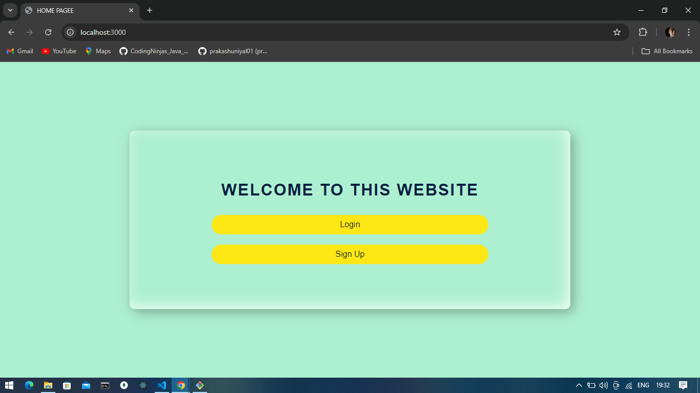
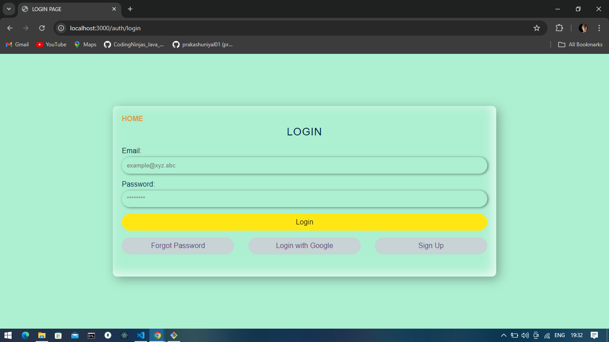
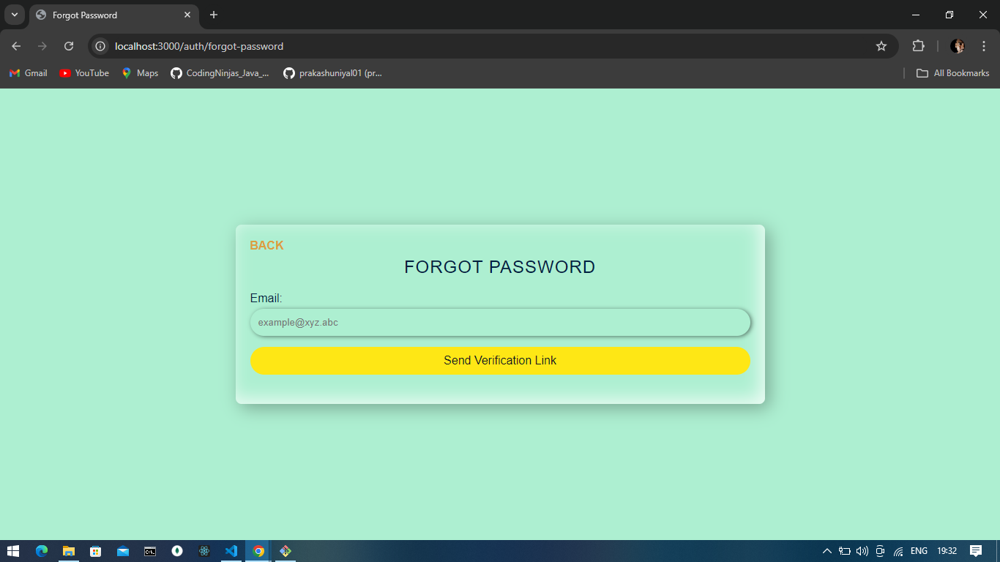
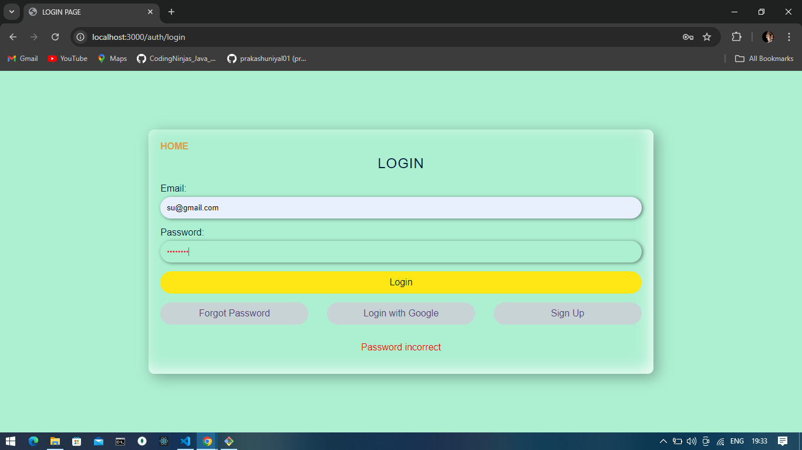
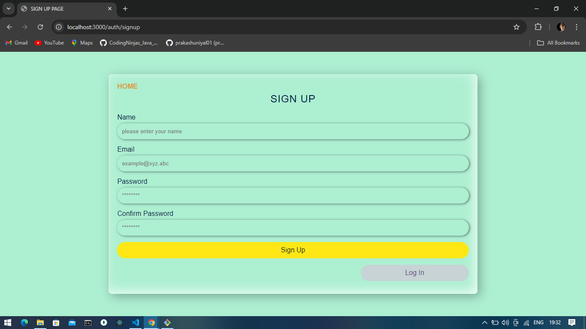
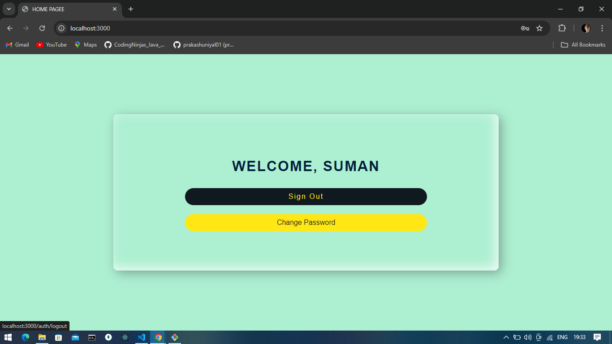
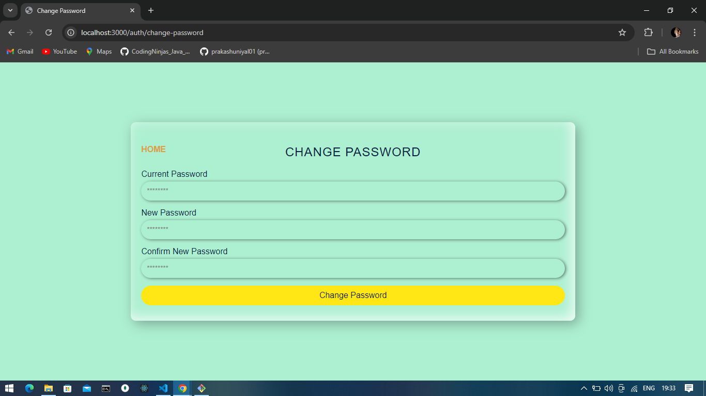

# Authentication App

A Node.js application for user authentication with features including sign-up, login, logout, change password, and password reset.

## Features

- User Registration
- Login and Logout
- Password Change and Reset
- Forgot Password with Email Link
- Google OAuth Integration
- Middleware for authentication
- Responsive and dynamic frontend

## Technologies

- **Backend**: Node.js, Express.js, MongoDB, Passport.js, bcryptjs, nodemailer
- **Frontend**: EJS, CSS
- **Development Tools**: nodemon, dotenv
- **Authentication**: Passport.js
- **Database**: MongoDB

## Installation

1. Clone the repository:

   ```bash
   git clone https://github.com/yourusername/authentication-app.git
   ```

2. Navigate to the project directory:

   ```bash
   cd authentication-app
   ```

3. Install the dependencies:

   ```bash
   npm install
   ```

4. Create a `.env` file in the root directory and add the following environment variables:

   ```env
   MONGO_URI=mongodb://localhost:27017/auth
   SESSION_SECRET=YOUR SEASON SECRET
   PORT=3000
   GOOGLE_CLIENT_ID=YOUR_GOOGLE_CLINT_ID
   GOOGLE_CLIENT_SECRET=YOUR_GOOGLE_SECRET
   EMAIL_USER=your_email@example.com
   EMAIL_PASS=your_email_password
   ```

5. Start the server:

   ```bash
   node server.js
   ```

   Or, for development with automatic restarts :

   ```bash
   npm i nodemon
   ```

   Paste in `pachace.json`

   ```bash
   "scripts": {
    "start": "node app.js",
    "dev": "nodemon app.js",
    "seed": "node seed/seedData.js"
   },
   ```

   Then in terminal run

   ```bash
   npm run dev
   ```

## ScreanShoots









## Usage

- Visit `http://localhost:3000` in your web browser.
- Access the following routes for authentication functionalities:
  - **Sign Up**: `/auth/signup`
  - **Log In**: `/auth/login`
  - **Change Password**: `/auth/change-password` (Authenticated users only)
  - **Forgot Password**: `/auth/forgot-password`
  - **Reset Password**: `/auth/reset-password/:token` (Token received via email)
  - **Logout**: `/auth/logout`

## Contributing

1. Fork the repository.
2. Create a new branch (`git checkout -b feature/YourFeature`).
3. Commit your changes (`git commit -am 'Add some feature'`).
4. Push to the branch (`git push origin feature/YourFeature`).
5. Create a new Pull Request.

## License

This project is licensed under the MIT License. See the [LICENSE](LICENSE) file for details.

## Acknowledgements

- [Node.js](https://nodejs.org/)
- [Express.js](https://expressjs.com/)
- [MongoDB](https://www.mongodb.com/)
- [Passport.js](http://www.passportjs.org/)
- [bcryptjs](https://github.com/dcodeIO/bcrypt.js)
- [nodemailer](https://nodemailer.com/)
